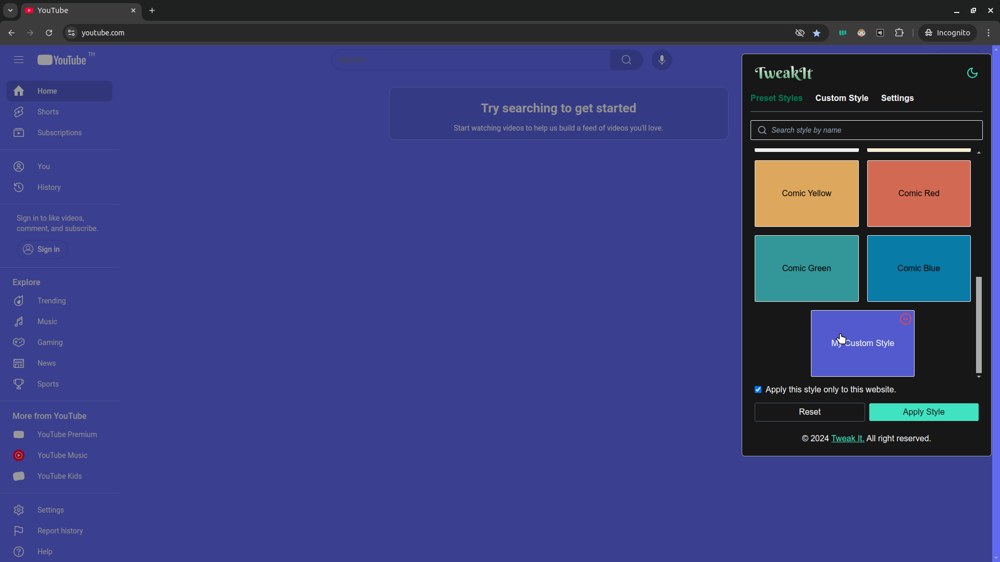

import { Callout, Tabs, Tab, Steps } from "nextra/components";

# Creating your custom style

When you finish tweaking settings for your style, you need to create style in order to use it later.

- Click `Create Style` at the bottom right of the extension modal.

- A prompt will be shown and enter your custom name. 

<Callout type="warning">
  As for now, if you want to change the style name later, you need to create a new one. So make sure that you provide your favourite style name.
</Callout>

- You should be able to see it in the `preset styles` tab.

