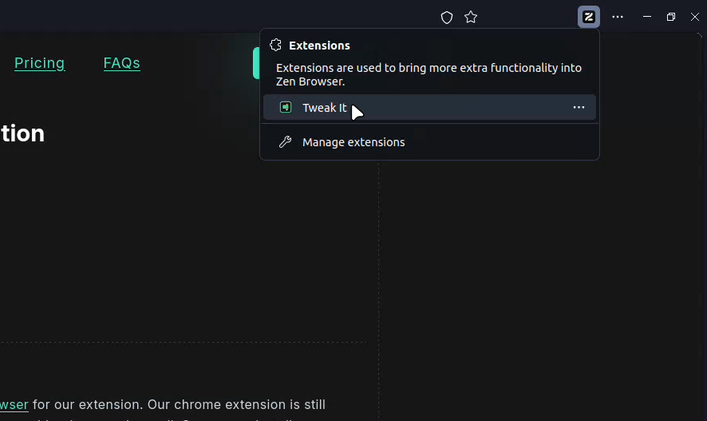

import { Callout, Tabs, Tab, Steps } from "nextra/components";

import { chrome, chromium, zen, arc, firefox, brave } from '../icons'

# Installation

Currently, we support firefox-based browsers and chromium-based browsers. Find our extension in related browser store.

 <a href="https://chromewebstore.google.com/detail/tweak-it/gkeoohnfijokalcjimhnodjlbdgfbibb"
                        target="_blank" className="px-4 shadow bg-primary text-dark py-2 flex items-center gap-x-4 rounded">
                        Install on Chrome
                    </a>
                    <a href="https://chromewebstore.google.com/detail/tweak-it/gkeoohnfijokalcjimhnodjlbdgfbibb"
                        target="_blank" className="px-4 shadow bg-primary text-dark py-2 flex items-center gap-x-4 rounded">
                        Install on Chromium
                    </a>
                    <a href="https://chromewebstore.google.com/detail/tweak-it/gkeoohnfijokalcjimhnodjlbdgfbibb"
                        target="_blank" className="px-4 shadow bg-primary text-dark py-2 flex items-center gap-x-4 rounded">
                        Install on Brave
                    </a>
                    <a href="https://chromewebstore.google.com/detail/tweak-it/gkeoohnfijokalcjimhnodjlbdgfbibb"
                        target="_blank" className="px-4 shadow bg-primary text-dark py-2 flex items-center gap-x-4 rounded">
                        Install on Arc Browser
                    </a>
                    <a href="https://addons.mozilla.org/en-US/firefox/addon/tweak-it/" target="_blank"
                        className="px-4 shadow bg-primary text-dark py-2 flex items-center gap-x-4 rounded">
                        Install on Firefox
                    </a>
                    <a href="https://addons.mozilla.org/en-US/firefox/addon/tweak-it/" target="_blank"
                        className="px-4 shadow bg-primary text-dark py-2 flex items-center gap-x-4 rounded">
                        Install on Zen Browser
                    </a>

After adding the extension in your browser, open the extension in extension tab section of your browser.

When a modal pops up, you have successfully installed the extension.

